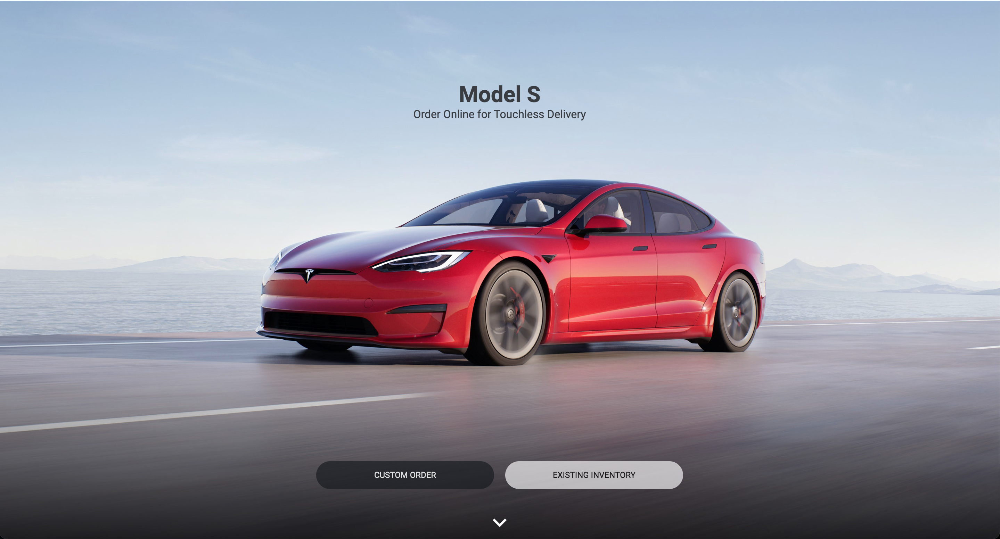

### Разработка Клона Тесла на ReactJS (Redux + Styled Components)

[Ссылка на проект](https://loving-mcnulty-0df2c9.netlify.app/)

### Libraries used

- `styled-components`
- `material-ui`
- `react-reveal`
- `redux`

---

### Font

- Font Link: [fonts.google.com](https://fonts.google.com/specimen/Montserrat?query=m)

